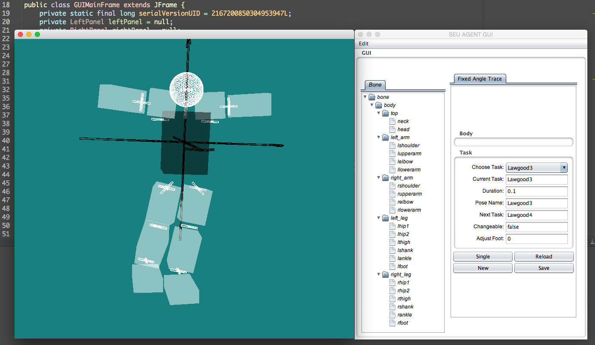

## a 3D humanoid robot simulation platform to generate robot posture data

## Usage

* compatible with JDK6, should install [Apple's JDK6](https://support.apple.com/kb/DL1572?locale=zh_CN) if on OSX.
* make sure `lib` directory is in `CLASSPATH`.
* make sure the native library file `libj3dcore-ogl.so` in `lib` directory is set to `LD_LIBRARY_PATH` environment variable.

## Screenshot

